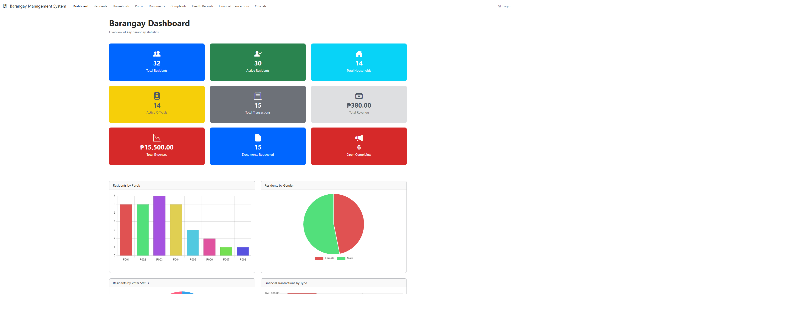
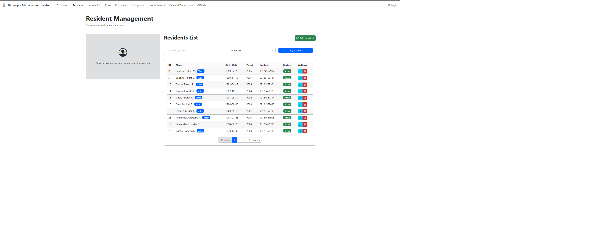
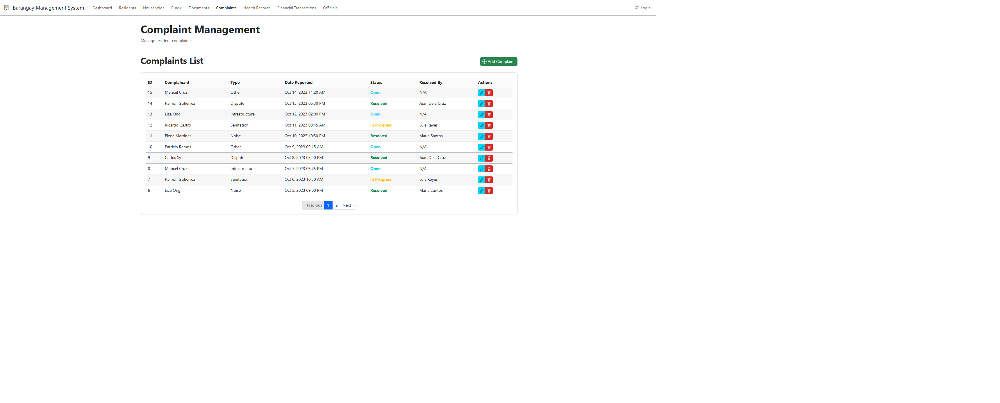

# Barangay Management System

A lightweight, modern barangay management system built with PHP, HTMX, and SQLite. This system provides essential tools for managing resident data and facilitating various barangay services.

## Features

* **Resident Management**: Track all barangay residents with personal details, contact info, vital statistics, and photo upload.
* **Purok System**: Organize residents by purok (neighborhood zone) with leader assignment capabilities.
* **Household Tracking**: Manage family units, track household heads, and associate residents with households.
* **Document Requests**: Process common barangay document requests (clearance, certificates, permits) with status tracking.
* **Complaint System**: Record and track resident complaints with descriptions, status, and resolution notes.
* **Health Records**: Maintain essential health information for residents (vaccinations, PWD/Senior status, etc.).
* **Financial Tracking**: Record basic financial transactions like fee payments and expenses.
* **Data Linking**: Interconnected data across residents, puroks, households, officials, documents, complaints, health records, and financials.

## Technology Stack

* **Backend**: Pure PHP (no heavy frameworks)
* **Frontend Interactivity**: HTMX (enhances HTML with AJAX, CSS Transitions, WebSockets, and Server Sent Events)
* **Database**: SQLite (single-file database, easy setup)
* **Styling**: Bootstrap 5
* **Icons**: Bootstrap Icons

## Requirements

* Web Server (Apache, Nginx, Caddy, etc.)
* PHP (version 7.4 or higher recommended)
    * `pdo_sqlite` extension enabled
    * `fileinfo` extension (recommended for robust file type validation)
* A `config/bootstrap.php` file for bootstrapping the application, including the PDO SQLite database connection setup.
* A `Database.php` class (or similar logic) to manage the database connection instance (`Database::getInstance()`).
* An `includes/styles.php` file that includes Bootstrap 5 CSS and Bootstrap Icons CSS.
* An `includes/scripts.php` file that includes Bootstrap 5 JavaScript and the HTMX library.
* A `navbar.php` file (assumed to be in the parent directory relative to `resident_management/`).

## Installation

1.  **Clone or Download:** Obtain the project files and place them in your web server's accessible directory (e.g., `htdocs`, `www`, or your virtual host root). Let's assume the project root is `barangay-system`.
2.  **Database Setup:**
    * Create a file named `database.sqlite` (or similar) in a directory *outside* your web server's document root for security, or within a non-web-accessible subdirectory (e.g., `barangay-system/data/database.sqlite`).
    * Ensure your PHP script can *read and write* to this SQLite file and its containing directory. You might need to adjust file/directory permissions (`chmod`).
    * Import the database schema. You will need an SQLite client (like `sqlite3` command line tool, DB Browser for SQLite, or a web-based SQLite manager) to open the `.sqlite` file and execute the SQL commands provided in your schema. Save the schema SQL into a file (e.g., `schema.sql`) and run it:
        ```bash
        sqlite3 /path/to/your/barangay-system/data/database.sqlite < schema.sql
        ```
3.  **Configure Database Connection:** Open your `config/bootstrap.php` file and update the PDO connection string to point to your SQLite database file.
    ```php
    // Example PDO connection string for SQLite
    $databasePath = __DIR__ . '/../data/database.sqlite'; // Adjust path as needed
    $dsn = 'sqlite:' . $databasePath;
    $options = [
        PDO::ATTR_ERRMODE            => PDO::ERRMODE_EXCEPTION,
        PDO::ATTR_DEFAULT_FETCH_MODE => PDO::FETCH_ASSOC,
        PDO::ATTR_EMULATE_PREPARES   => false,
    ];
    try {
        $pdo = new PDO($dsn, null, null, $options);
        // Your Database::getInstance() logic should use this $pdo object
    } catch (\PDOException $e) {
        throw new \PDOException($e->getMessage(), (int)$e->getCode());
    }
    ```
4.  **Create Upload Directory:** Create a directory structure `uploads/residents/` within your `resident_management` directory (e.g., `barangay-system/resident_management/uploads/residents/`).
5.  **Set Permissions:** Ensure your web server user has **write permissions** to the `uploads/residents/` directory. This is necessary for uploading resident photos.
6.  **Include Assets:** Verify that `includes/styles.php` includes the correct paths for Bootstrap CSS and Bootstrap Icons CSS, and `includes/scripts.php` includes Bootstrap JS and the HTMX JavaScript library. Ensure the path for `../navbar.php` is correct.

## Database Schema (Conceptual)

The system utilizes the following tables to store and manage data:

* `purok`: Stores information about the barangay's zones.
* `residents`: Core table for individual resident information, linked to purok and households.
* `households`: Stores information about residential units/families, linked to purok and residents.
* `documents`: Records requests for barangay documents, linked to residents and barangay officials.
* `complaints`: Records and tracks resident complaints, linked to residents and officials.
* `barangay_officials`: Lists elected or appointed barangay officials, linked to residents.
* `health_records`: Stores resident health information, linked to residents and officials.
* `financial_transactions`: Records financial activities, linked to residents and officials.

*(Note: The specific SQL `CREATE TABLE` statements are typically found in a separate `schema.sql` or `database.sql` file.)*

## Configuration

* **Database File:** Set the path to your `database.sqlite` file in `config/bootstrap.php`.
* **File Uploads:** Configure the upload directory, allowed file types, and maximum file size in `resident_management/index.php`.

## Usage

1.  Access the `resident_management/index.php` file via your web browser.
2.  The interface, powered by HTMX, will allow you to interact with the resident data.
3.  Use the links/buttons provided (presumably in the navbar) to navigate between different sections of the system as they are implemented.

## ERD


## Screenshots







## Contributing

Contributions are welcome! Please fork the repository and submit pull requests following standard coding practices.

## License

This project is open-source under the MIT License. See the `LICENSE` file for details.